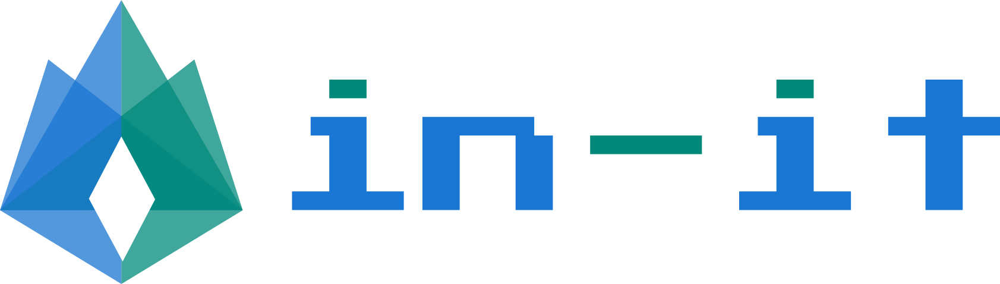

<p align="center">
  
</p>

<p align="center">
  <strong>Everything is in it.</strong> — Hono-only dependency SaaS starter framework
</p>

<p align="center">
  <a href="https://jsr.io/@kotsumo/in-it"></a>
  <a href="./LICENSE"></a>
  <a href="https://github.com/sponsors/kotsumocom"></a>
</p>

<p align="center">
  🌐 <a href="https://in-it.dev">Website</a> · 📖 <a href="https://in-it.dev/docs">Docs</a> · 🎨 <a href="https://in-it.dev/colors">Color Preview</a>
</p>

## 🚀 Quick Start

```bash
deno add @kotsumo/in-it
```

```typescript
import { Button, Card, ThemeToggle, Dialog } from "@kotsumo/in-it";
```

```html
<link rel="stylesheet" href="@kotsumo/in-it/src/css/main.css" />
```

## ⚙️ Project Configuration (`in-it.config.ts`)

All settings are optional with sensible defaults. Run `deno task gen` to apply.

```typescript
import { defineConfig } from "@kotsumo/in-it/config";

export default defineConfig({
  site: { name: "My SaaS", lang: "ja" },
  theme: { primary: "#6750a4" },
  icons: "outlined",    // or "filled"
  locale: "ja",         // "en" (default) or "ja"
  auth: { provider: "supabase" },  // metadata only
  overrides: {
    Button: "./client/overrides/Button.tsx",
  },
});
```

| Field | Generates | Default |
|---|---|---|
| `site` | `index.html` title, lang, meta description | `"My SaaS"`, `"ja"` |
| `theme` | `client/theme.css` (HCT color scheme) | `"#6750a4"` |
| `icons` | Icon import style | `"outlined"` |
| `locale` | `client/locale-init.ts`, CJK CSS, Google Fonts | `"en"` |
| `auth` | Nothing (metadata for AI/developers) | — |
| `overrides` | `client/components.ts` barrel | All defaults |

### 🇯🇵 Japanese UI Mode (`locale: "ja"`)

- All built-in component strings in Japanese
- Noto Sans JP auto-loaded from Google Fonts
- Font stack: `Inter, Noto Sans JP, system-ui, sans-serif`
- Body font size: 16px (CJK optimized)
- Line height: 1.7 (CJK optimized)

## ✨ Features

| | Feature | Description |
|---|---|---|
| ⚡ | **One Stack** | Hono handles both server and client |
| 🛡️ | **Hono-Only Dependency** | ARIA, router, HCT color, icons, Markdown parser — all built from scratch |
| 🧩 | **50+ Components** | Forms, feedback, navigation, layouts |
| 🎨 | **HCT Color System** | Material Design 3 compatible, light/dark themes from a single preset |
| ♿ | **ARIA Compliant** | WAI-ARIA APG compliant interactive components |
| 📎 | **Built-in Icons** | 5,093 Tabler-derived SVG icons (+ 1,053 filled), tree-shakeable |
| 🔄 | **Dual Runtime** | Works on both Deno and Bun |

## 🧩 Components

### Interactive (WAI-ARIA Compliant)

| Component | ARIA Pattern | Description |
|---|---|---|
| Switch | Switch | Toggle switch |
| Dialog | Dialog (Modal) | Modal dialog with focus trapping |
| Tabs | Tabs | Tab switching with arrow key navigation |
| Menu | Menu Button | Dropdown menu |
| Select | Listbox | Select listbox |
| Combobox | Combobox | Searchable select |
| Accordion | Accordion | Collapsible panels |
| Popover | Dialog (Non-modal) | Popover |
| Toast | Alert / Live Region | Notification toasts |
| Checkbox | Checkbox | Checkbox input |
| RadioGroup | Radio Group | Radio button group |
| Drawer | Dialog (Non-modal) | Side drawer |
| ThemeToggle | Switch | Light/dark theme toggle |
| Tooltip | Tooltip | Tooltip |
| Slider | Slider | Range slider |
| Pagination | — | Pagination |
| Steps | — | Step indicator |

### Form

Input, Textarea, NumberInput, PasswordInput, TagsInput, FileUpload, Slider, RatingGroup, Editable, Toggle, PinInput

### UI

Button, Badge, Card, StatCard, DataTable, Avatar, Chip, Skeleton, EmptyState, Divider, Kbd, Alert, Progress, ProgressCircular, Breadcrumb, Aside

### Layout

| Component | Usage |
|---|---|
| AdminShell | Admin dashboard with sidebar, toolbar, and content area |
| DocsShell | Documentation site with sidebar, content, and table of contents |
| LandingHeader / Hero / Features / Section / Footer | Landing page building blocks |

## 🎨 HCT Color System

Material Design 3 compatible HCT (Hue-Chroma-Tone) color system, implemented from scratch with **no additional dependencies**.

```typescript
import { HctColor, generateScheme, getPresetCss } from "@kotsumo/in-it";

// Easy setup with presets
const css = getPresetCss("teal");

// Generate a scheme from a custom color
const { light, dark } = generateScheme("#6750a4");

// Manipulate colors directly with HCT
const color = HctColor.fromHex("#1565c0");
const lighter = color.withTone(80).toHex();
```

### Color Presets

| Preset | Hex | Suited For |
|---|---|---|
| `purple` | `#6750a4` | Default. Calm and professional |
| `blue` | `#1565c0` | Business applications |
| `teal` | `#00695c` | Healthcare, sustainability |
| `green` | `#2e7d32` | Growth, success |
| `orange` | `#e65100` | Energetic, creative |
| `pink` | `#c2185b` | Creative, lifestyle |
| `red` | `#c62828` | Alerts, urgency |
| `indigo` | `#283593` | Technology, fintech |

## 📖 Documentation System

Built-in Markdown parser with JSON frontmatter, auto-generated TOC, and Aside/Callout support:

```markdown
---json
{
  "title": "Button",
  "description": "Button component",
  "sidebar_label": "Button",
  "sidebar_position": 1
}
---

# Button

> [!TIP]
> in-it works on both Deno and Bun.
```

## 🛠 Tech Stack

| Technology | Role |
|---|---|
| [Hono](https://hono.dev) | Web framework (server + client JSX) |
| [Deno](https://deno.com) / [Bun](https://bun.sh) | Runtime |
| [Vite](https://vitejs.dev) | HMR during development |

## 📦 CSS Class Naming

All classes use the `ii-` prefix with BEM convention:

```css
.ii-button          /* Block */
.ii-button__icon    /* Element */
.ii-button--filled  /* Modifier */
```

## 📄 License

[MIT](./LICENSE)

## Icons

Built-in icons are derived from [Tabler Icons](https://tabler.io/icons) (MIT License).
SVG path data is bundled directly — no runtime dependency on the Tabler package.
Tree-shakeable individual imports are available for bundle-size-conscious users.

We're exploring the development of a custom icon set for in-it.
If you're a designer interested in contributing, please reach out via
[GitHub Discussions](https://github.com/kotsumocom/in-it/discussions).

## ❤️ Sponsors

We welcome sponsors to support the development of in-it!

[See our sponsors →](./SPONSORS.md)

[](https://github.com/sponsors/kotsumocom)